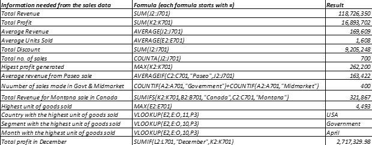

# Introduction to Excel for Data Analysis

I am currently learning Data Analytics courtesy of the third Data Analysis cohort held by Promise Nonso, and I was assigned the task of creating a table of information which consists of 20 rows and 5 columns. The table included employees details such as:
•	Employee Id
•	Employee Full Name
•	Department (Communication, IT, and Sales)
•	Salary ($5,000- $25,000)
•	Job Type (Freelance, Contract, Part-time)

## Activity
# Task 1
The following tasks were assigned for the first task:

•	Show the employees who are working as freelancers and earning above $10,000.

•	Split the employees' full names into first names and last names, highlighting any form of duplicate value in the table.

•	Highlight employees whose names start with E in yellow colour, and highlight the highest salary value in green and the lowest salary value in red.

For the first task shown below, I was able to generate data for employees and using data manipulation skills, I filtered the employees who are freelancers and whose salary is greater than or equal to $10,000. From the analysis, the Freelancers that were paid above $10,000 are three (2 from IT department and 1 from Communication department).

For the second task shown below, I was able to split the employees full name to first name and last name by using the text to column function.

For the third task shown below, I was able to filter the employee’s full name which start with "E", and then sorted the data to get the highest paid and lowest paid employees, and then ended up checking if there are any duplicates using conditional formatting.
From the analysis,
•	Three employees’ names started with the letter E and was highlighted in yellow color.
•	The highest paid was highlighted in green and the lowest paid was highlighted in red.
•	There were no duplicates.

# Task 2

There was a final task which focused on analyzing a sales data and providing the following information from the data analysis:

•	Total Revenue and Profit generated.

•	Average revenue and units sold for every order.

•	Total Discount given in $.

•	Total Number of sales recorded.

•	Highest Profit.

•	Create a column called ‘Sales range’ and use formula to show ‘high sales’ and ‘low sales’.

•	Average Revenue from Each Sale of "Paseo".

•	Number of Sales made in "Government

•	Number of Sales made in "Midmarket".

•	Number of Sales made in Government and Midmarket.

•	Total Revenue generated from sales of "Montana" in Canada.

•	The country segment, Month that has the highest unit sold.

•	Total profit made in December.

For this task as shown below, an additional column (Column O) named ‘Sales Range’ was created using the formula =Average() to get the average sales (169609) which was used to determine if the sales was high sales or low sales using the formula =IF(J2>169609,”High Sales”,”Low Sales”)

From the analysis of the sales data above using formulas, the required information was analyzed and presented in the table below:

# Conclusion
The information provided on excel spreadsheet was successfully analyzed and findings gathered from the analysis can be used to make data-driven decisions that can increase the sales and growth of the business.  The skills applied in this analysis are as follows; Data manipulation, use of conditional formatting, use of filters, text-to-column and use of some excel formulas.
